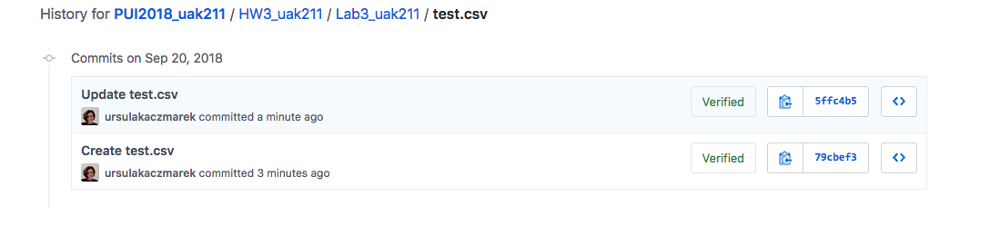
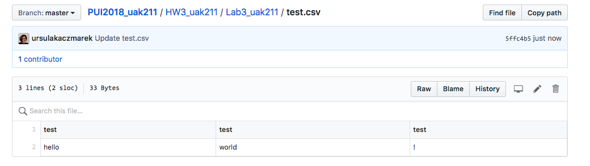
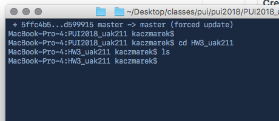

I completed these assignments on my own. 
For assignment 1, when Terminal threw the error  git fatal: bad revision 'rm',
this [stackoverflow thread](https://stackoverflow.com/questions/32715034/removing-files-from-git-history-bad-revision-error)
helped me find the problem.

The github folder history:

The csv content:

The now-empty local directory:

I completed part 2 by relying on this [stackoverflow answer](https://stackoverflow.com/questions/13872533/plot-different-dataframes-in-the-same-figure#13873014) to help me plot two aggregated variables using df.plot().

I completed part 3 on my own, although I stupidly wasted way too much time dealing with this runtime error: requests JSONDecodeError: Expecting value, because I omitted the question mark in the url string and instead of asking someone to proof my code for typos I went to a hundred stack overflow threads instead. 

For assignment 4, I had never used fout to write text to a file and have little experience with string formatting outside of Pandas, so I relied on [this](https://www.digitalocean.com/community/tutorials/how-to-use-string-formatters-in-python-3) and [this](https://stackoverflow.com/questions/35120899/python-writing-text-to-a-file#35120948) for help in writing the CSV.
