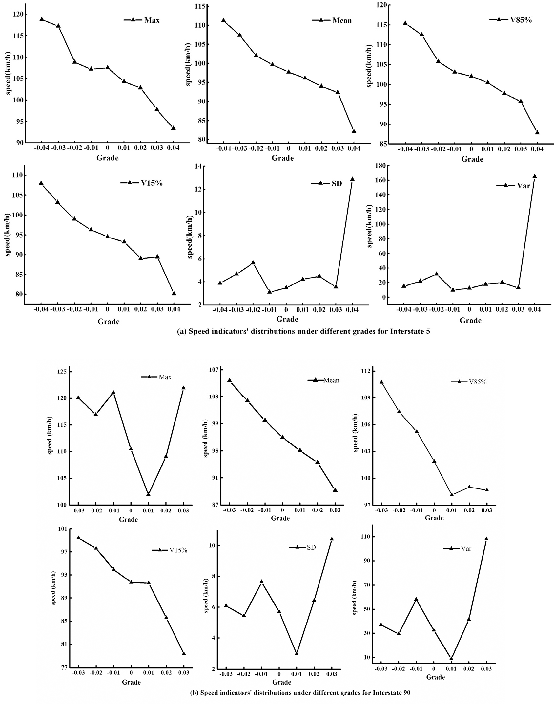
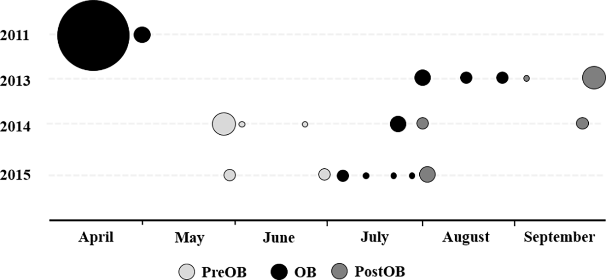

for these assignments, sam manzi and i discussed general approaches, but we both completed the work on our own.

#### assignment 1:
my review of tm1722's citibike proposal is [here](https://github.com/timurmukhtarov/PUI2018_tm1722/blob/master/HW4_tm1722/citibike_review_of_tm1722.md)

#### assignment 2: statistical tests in the scientific literature

| **Statistical Analyses**	|  **IV(s)**  |  **IV type(s)** |  **DV(s)**  |  **DV type(s)**  |  **Control Var** | **Control Var type**  | **Question to be answered** | **_H0_** | **alpha** | **link to paper**| 
|:----------:|:----------|:------------|:-------------|:-------------|:------------|:------------- |:------------------|:----:|:-------:|:-------|
one-tailed _t_-test	| 1: roadway grade| continuous | 1: speed | continuous | 3: weather, traffic flow, time| categorical, ordinal, continuous | is there significant difference among speed levels with neighboring roadway grades | speed at a smaller grade equals that at a neighboring larger grade | 0.05 | [Evaluating the impacts of grades on vehicular speeds on interstate highways](https://journals.plos.org/plosone/article?id=10.1371/journal.pone.0184142) 
Spearman's correlation & multivariate OLS regression|3: population percent of race, population percent of ethnicity, income|continuous|1: percentage of urban tree canopy in census block group|continuous|1: income| continuous|what are the potential inequities associated with the distribution of urban tree cover in relationship to race/ethnicity and income?|urban tree canopy cover would be positively correlated with increasing income and negatively correlated with minority populations in all study cities|not explicitly stated in text, but model outputs indicate significance levels at 0.05 and 0.01|[Trees Grow on Money: Urban Tree Canopy Cover and Environmental Justice](https://journals.plos.org/plosone/article?id=10.1371/journal.pone.0122051)
logistic regression|7: habitat, microhabitat, sex, age class, hematological parameters, weight, distance|categorical, continuous|1:detection of cause of death|binary|-|-|what are the predictors of mortality in _T. carolina carolina_|predictor variable does not have an effect on the detection of cause of death |0.05|[Investigation of multiple mortality events in eastern box turtles (Terrapene carolina carolina)](https://journals.plos.org/plosone/article?id=10.1371/journal.pone.0195617#sec002)

main plots presented in papers:

* the t-test paper

* the correlation/ols multivariate regression paper

* the logistic regression paper

#### assignment 3: reproducing post-prison employment study
i completed this assignment on my own with no need to reference material

#### assignment 4: citibike populations tests of correlation
i was lucky to have already written functions to pull data for two separate months, one winter and one summer, for HW4. i have no experience with geopandas, but have worked with the rgeos, rgdal, and sp packages in R, so i wrote a script in R to identify the bike station boroughs. 

