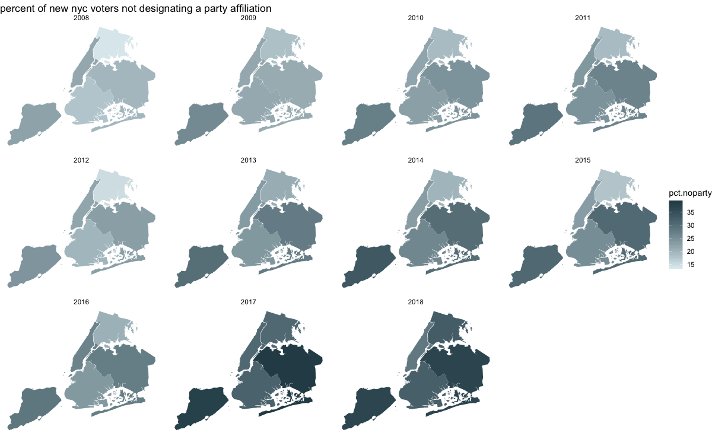

I completed assignment 1 using the New York State voter list received through a FOIL request to the state board of elections. Data 
were munged and visualized using the rgdal, sp, tidyverse, and ggplot2 packages in R (see the viz.R script included in this repo folder).

Figure 1: Previous 10 years of new voter registrations in New York City show a notable increase in the percentage of voters
declining to desginate a party affiliation in their registrations.

